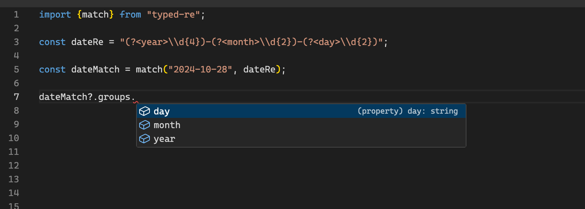

# typed-re

> Template literal types for regular expression capturing groups

When using a regular expression to parse a string, use capturing groups and the resulting
`groups` property will be correctly typed.

## Install

```bash
npm install -D typed-re
```

## Date example

```typescript
import {match} from "typed-re";

const dateRe = "(?<year>\\d{4})-(?<month>\\d{2})-(?<day>\\d{2})";

const dateMatch = match(dateRe, "2024-10-28");

console.log(dateMatch?.groups.day); // OK, will be 28

// console.log(dateMatch?.groups.hour); TYPE ERROR
```



## Email example

```typescript
import {match} from "typed-re";

const mailRe = "^(?<username>[a-zA-Z0-9._%+-]+)@(?<domain>[a-zA-Z0-9.-]+\\.[a-zA-Z]{2,})$"

const mailMatch = match(mailRe, "mark@example.com");

console.log(mailMatch?.groups.username); // OK, will be mark

// console.log(mailMatch?.groups.host); TYPE ERROR
```

## Playground

Try the code above in the TypeScript playground:

[](https://www.typescriptlang.org/play/?#code/JYWwDg9gTgLgBAbxAQxgYwBYF84DMoQhwBEMAnmAKYAmAtFJcQNwBQLA9J13ACKqVxKAD2TgANgK5c2aCADsAzvGr8ASgIC8JABQB+ADxlKyKAD4AOueoIALFgCUtPfpDyYGC1YQAmB04MqZJ7WvvbMMvJKcCowlACyqJhwWijoGNrE3gAM3ja0AIxZtN4AHMQANNFqlPasEYoQEgB0YhAA5tox8YkYuk1tBACuYApNgbVwnHAA8gDSbFOyDc2tHV0JaX0DEMOjGDtQEwCiqqrTqmyXUlNHKMBigiLiktf1UXdi6skkAHrOgwpKFA5KJKKYANrIWgALwAgrQAFpFACcTQA+gBSADUtAAulj7AABZzUQjIYByCFQuGIlFNPFYyxNSEw+EI3E+coOAAkxDe8A+GySKR6GRQUAA1oThKIwM1ZCAKnAPupam9GpQWu1tIKelshiMmgCgSCQDUmJN2DN5hwrUsFBqtR1dZt+ga9hAlMdTucgA)


## Usage

### `match(s, regexp [, flags])`

| Name   | Type              | Description                  |
|--------|-------------------|------------------------------|
| s      | string            | String to parse              |
| regexp | string            | Regular expression as string |
| flags  | string [optional] | Optional [flags](https://developer.mozilla.org/en-US/docs/Web/JavaScript/Guide/Regular_expressions#advanced_searching_with_flags)        |


## License

Copyright 2024 [Edwin Martin](https://bitstorm.org/) and released under the MIT license.
